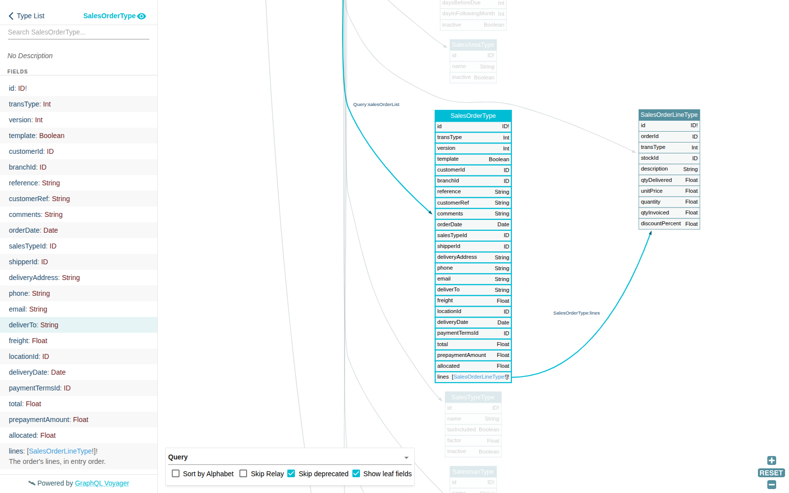

# FrontAccounting GraphQL module

A GraphQL API for [FrontAccounting](https://frontaccounting.com/), delivered as a
module (extension) that lives at `modules/graphql` inside a FrontAccounting tree.

**Status: Release 4 (Extensions and recurring invoices).** What comes next is in
[`ROADMAP-2026-09.md`](ROADMAP-2026-09.md); the designs are in
`docs/superpowers/specs/`.

## What it covers

Runs on FrontAccounting 2.4 — upstream `master` or the `cambell-prince` fork — on PHP
7.4 to 8.3. Every request acts as a real FrontAccounting user, so roles and security
areas apply; one company per request; every response is JSON.

| Area | Queries | Mutations |
|---|---|---|
| Authentication | `me`, `apiVersion` | `login`, `tokenRefresh`, `tokenRevoke`; long-lived machine tokens issued by `bin/fa-token` |
| Reference data | `paymentTermsList`, `taxGroupList`, `salesAreaList`, `salesmanList`, `locationList`, `shipperList`, `creditStatusList`, `currencyList`, `stockItemList`, `salesTypeList`, `bankAccountList` | — (read-only) |
| Customers | `customerList` (with `branches`, `contacts`, `balance`), `branchList`, `contactList` | `customerCreate`/`Update`/`Delete` (create adds the default branch and contact), `branchCreate`/`Update`/`Delete`, `contactCreate`/`Update`/`Delete` |
| Sales orders | `salesOrderList` (with `lines`, `recurring`), `salesOrderLineList` | `salesOrderCreate`/`Update` (version-checked)/`Delete` (FrontAccounting's cancel: deleted, or closed once delivered) |
| Recurring schedules (sgw_sales extension) | `recurring` on sales orders — from the `sgw_sales` extension, when it is active for the company | nested `recurring` input on the order mutations (the same extension) |
| Recurring invoices (sgw_sales extension) | `recurringDueList(asOf)` | `recurringGenerate` (deliver, invoice and optionally email each due order; items independent) |
| Deliveries | `deliveryList`, `deliveryLineList` | `deliveryCreate` (whole or partial), `deliveryDelete` (void) |
| Invoices | `invoiceList` (with `lines`, `total`, `outstanding`), `invoiceLineList` | `invoiceCreate` (from deliveries, or an order in one step), `invoiceDelete` (void), `invoiceEmail` (FrontAccounting's `rep107`) |
| Payments | `customerPaymentList` (with `allocations`, `unallocated`), `allocationList` | `customerPaymentCreate` (with allocations), `customerPaymentUpdate` (reallocate), `customerPaymentDelete` (void) |

Every list takes `query: MangoInput` (a JSON Mango selector, `limit`, `skip`,
`sort`). Writes go through FrontAccounting's own functions — references, audit trail,
GL postings, hooks — in one transaction per mutation call; a batch is atomic.

Rows marked *(sgw_sales extension)* are served by the `sgw_sales` FrontAccounting
extension through this module's extension contract, only for companies where
`sgw_sales` is active; see [Extensions](#extensions).

Not yet: credit notes, quotations, direct and prepayment invoices, accounts
payable, general ledger and banking, inventory maintenance. See the roadmap.

## Calling the API

Requirements: FrontAccounting 2.4 — upstream `master` (tested at 2.4.20), or the
`cambell-prince/frontaccounting` fork; `config_graphql.php` copied
from `config_graphql.example.php` with a secret of at least 32 bytes; the extension
activated; and a role that holds **GraphQL API access** plus whatever sales areas the
client needs. No role has it until you grant it, not even System Administrator.

Sign in, keep the pair, send the access token as a bearer token:

```php
$http = new GuzzleHttp\Client(['base_uri' => 'https://fa.example.com/modules/graphql/']);

$gql = function (string $query, array $variables = [], ?string $token = null) use ($http): array {
    $response = $http->post('', [
        'headers' => $token ? ['Authorization' => "Bearer $token"] : [],
        'json' => ['query' => $query, 'variables' => (object) $variables],
        'http_errors' => false,
    ]);
    return [$response->getStatusCode(), json_decode((string) $response->getBody(), true)];
};

[, $body] = $gql(
    'mutation ($u: String!, $p: String!) { login(user: $u, password: $p) { accessToken expiresIn refreshToken } }',
    ['u' => 'panel', 'p' => getenv('FA_PASSWORD')]
);
$pair = $body['data']['login'];

[$status, $body] = $gql('{ me { login areas } }', [], $pair['accessToken']);
```

- The access token lasts 15 minutes. On **HTTP 401**, call `tokenRefresh` with the
  refresh token and retry once.
- A refresh token is **single use**: every `tokenRefresh` returns its successor —
  store it. Presenting a used one revokes all of that user's refresh tokens; sign in
  again with the password.
- HTTP 403 means the user's role lacks GraphQL API access.
- Errors carry `extensions.code`: `UNAUTHENTICATED`, `FORBIDDEN`, `BAD_INPUT`,
  `NOT_FOUND`, `FA_REJECTED` (with FrontAccounting's own messages in
  `extensions.messages`), `INTERNAL`.
- `login` is refused over plain HTTP unless `allow_insecure_login` is set:
  FrontAccounting stores passwords as unsalted MD5.
- One company per request. `login` takes `company` (default 0), and a refresh token
  is `<company>.<secret>`; a request that has opened one company — by its bearer
  token or by an earlier field — is refused `UNAUTHENTICATED` for any other. Send a
  separate request per company.
- The module answers `POST` at its directory (or `…/index.php`). Anything else is
  JSON too: 405 for another method, 404 for another path — except a browser's `GET`
  (below).

### Browsing the schema

Open the module's directory in a browser — `http://localhost:8100/modules/graphql/`
in the dev stack — and the schema is drawn by
[GraphQL Voyager](https://github.com/graphql-kit/graphql-voyager):



A `GET` whose `Accept` includes `text/html` gets the page; any other `GET` keeps the
JSON 405. The page loads Voyager 2.1.0 from cdn.jsdelivr.net (pinned, with
subresource integrity) and introspects the endpoint by `POST`, anonymously — so it
shows what an anonymous client sees: the core schema, without the fields an
extension adds once a company is open. Introspection is open whatever this page
does; `'voyager' => false` in `config_graphql.php` only turns the page off.

### Machine tokens

A service that calls the API unattended — a hosting panel, a cron job — should not
hold a FrontAccounting password. Give it a **machine token** instead: a bearer token
for one FrontAccounting user in one company, living up to a year
(`machine_ttl_max`, default 31536000 seconds), and revocable at any time. It is sent
exactly like an access token (`Authorization: Bearer …`); there is nothing to
refresh. Machine tokens are issued only from the command line on the server, never
by the API, and run as the web server's user outside the dev stack (for example
`sudo -u www-data`) — not root, or FrontAccounting may create root-owned files
under `tmp/` that the web server can no longer write:

    # in a development environment, from the FrontAccounting checkout, prefix each with:
    #   docker/ci/plugin-dev.sh --env graphql exec --dir modules/graphql
    bin/fa-token issue  --company 0 --user sgwpanel --days 365 --label "my.saygoweb.com"
    bin/fa-token list   --company 0
    bin/fa-token revoke --company 0 <jti>

- `issue` prints the token **once**, alone on stdout (its jti and expiry go to
  stderr). Only its id (`jti`) is stored, in the company's `graphql_machine_token`
  table, so a lost token cannot be shown again: issue another. It refuses a lifetime
  over `machine_ttl_max`, an unknown or inactive user, and a user whose role lacks
  GraphQL API access.
- `list` shows every token of the company: jti, user, live/revoked/expired, issue
  and expiry times, when it was last used (to the minute), and its label.
- `revoke` takes effect on the next request: every request with a machine token
  looks its jti up, and an unknown, revoked or expired one is **HTTP 401**.
- A company activated before machine tokens landed has no `graphql_machine_token`
  table: `issue`, `list` and `revoke` then refuse with the fix — re-activate the
  GraphQL extension for it (Setup → Install/Activate Extensions) or apply
  `sql/update_1.1.sql` directly.
- The token acts as its user: deactivating the user, or taking GraphQL API access
  from its role, refuses the token too (401 / 403), and the role's areas limit what
  it can do. Give the service a user of its own, in a role holding only what the
  service uses, with an email nobody can receive (or keep FrontAccounting's password
  reset off) — otherwise a reset mails that address a usable password. The dev stack
  seeds `sgwpanel` in "GraphQL Panel": GraphQL API access plus SA_SALESTRANSVIEW,
  SA_CUSTOMER and SA_SALESORDER, which is what `customerList` (with balances),
  `salesOrderList/Create/Update`, `invoiceList` and `customerPaymentList` need — but
  those areas allow more than the panel happens to use: SA_CUSTOMER also permits
  creating, updating and deleting customers, branches and contacts, and
  SA_SALESORDER also permits deleting orders. Read-only customer access would need
  a separate role area; that is a later release. Its password is an unusable
  `!unusable-…` string that no `md5()` hash can equal, so it can never `login`, and
  its seeded email (`sgwpanel@invalid.invalid`) is unroutable (RFC 2606/6761).
- **Rotate** by issuing a new token, switching the service to it, then revoking the
  old one: both work in between.
- **Use HTTPS in production.** A machine token is as good as a password for a year;
  send it only over TLS, and keep it out of logs and repositories.
- `tokenRefresh` never accepts a machine token, and neither `login` nor
  `tokenRefresh` ever issues one.

Generated lists take an optional Mango query:

```php
[, $body] = $gql(
    'query ($q: MangoInput) { salesTypeList(query: $q) { id } }',
    ['q' => ['selector' => json_encode(['id' => 1])]],
    $pair['accessToken']
);
```

### Reference lookups

Read-only lists of what an order needs, for any role holding **Sales orders
edition** (`SA_SALESORDER`). FrontAccounting's setup areas are not needed:
`paymentTermsList`, `taxGroupList`, `salesAreaList`, `salesmanList`,
`locationList`, `shipperList`, `creditStatusList`, `currencyList`,
`stockItemList`, `salesTypeList`. Each takes an optional Mango `query`. A sellable
item is one with `mbFlag` not `F`, and neither `inactive` nor `noSale`.

### Customers, branches and contacts

`customerCreate`, `customerUpdate`, `customerDelete`; `branchCreate`, …;
`contactCreate`, … (role area **Sales customer and branches changes**,
`SA_CUSTOMER`). Every mutation takes a list and runs it in one transaction:
either the whole list is written or none of it, and a refusal names the item in
`extensions.index`. Create inputs have no `id`; update inputs require it, and
fields you leave out are left unchanged.

`customerCreate` does what FrontAccounting's customer page does. With the
company's *auto create branch* setting on (the default), it needs `branch`
defaults and creates the customer's first branch. `contact` creates the CRM
contact linked to the customer and that branch. Percentages are 0–100.

### Sales orders

`salesOrderCreate`, `salesOrderUpdate`, `salesOrderDelete`, `salesOrderList`
(**Sales orders edition** to write, **Sales transactions view** to read), and
`salesOrderLineList`, a read-only list of order lines (**Sales transactions
view**); lines are written through their order. An
order takes its customer's and branch's defaults (price list, payment terms,
delivery address, location, shipper) unless you give them. A line's price
defaults to the price list's. Dates are `YYYY-MM-DD`.

- **Updates carry `version`**, the one you last read. If the order changed since,
  the update is refused (`FA_REJECTED`): read it again and retry. `lines`, when
  given, replaces the order's lines. A line with an `id` is updated, one without
  is added, and one left out is removed. A delivered line can't be removed or
  reduced below what was delivered. Once anything is delivered or invoiced, the
  customer, branch, price list, date, payment terms and prepayment are fixed.
- **Order ids come round again.** FrontAccounting gives a new order the number
  after the highest one, so when the newest order is deleted its id goes to the
  next order, which starts again at version 0. A client that keeps an order's id
  should check the order's `customerId` when it reads it back or before it
  updates it.
- **`salesOrderDelete` is FrontAccounting's *cancel order*.** An order with no
  deliveries is deleted. One with deliveries is closed instead: its quantities
  are cut to what was delivered, and it stays readable.
- FrontAccounting's warnings (for example, a price below cost) don't fail the
  mutation. They arrive in the response's top-level `extensions.warnings`.

### Recurring orders

With the `sgw_sales` extension active, an order can recur:

```graphql
recurring: { start: "2026-10-01", repeats: MONTH, every: 1, day: 1 }
```

`repeats` is `MONTH` (with `day`, 1–31) or `YEAR` (with `monthDay`, `"MM-DD"`).
To end a schedule, update the order with `recurring: { …, end: "2027-09-30" }`.
The schedule is written in the same transaction as its order: deleting the order
deletes it, and closing the order ends it. Where `sgw_sales` is not active for the
company, `recurring` is absent from that company's schema, on input and output (a
query or input that names it fails validation as an unknown field). A recurring order keeps its
header editable once invoices have been generated from it, and its quantities
may drop below what was delivered, as `sgw_sales`' own page allows: each
generated invoice raises the delivered quantity. Generating the recurring
invoices is [`recurringDueList`/`recurringGenerate`](#recurring-invoice-generation-sgw_sales),
also served by `sgw_sales`.

### The panel's flow

```php
[, $body] = $gql(
    'mutation ($in: [CustomerCreateInput!]!) { customerCreate(input: $in) { id branches { id } } }',
    ['in' => [[
        'name' => 'Example Sdn Bhd', 'ref' => 'EXAMPLE', 'address' => "1 Jalan Contoh\nKuala Lumpur",
        'salesTypeId' => 1, 'paymentTermsId' => 1, 'creditStatusId' => 1,
        'branch' => ['salesmanId' => 1, 'salesAreaId' => 1, 'taxGroupId' => 1, 'locationId' => 'DEF', 'shipperId' => 1],
        'contact' => ['email' => 'billing@example.com'],
    ]]],
    $pair['accessToken']
);
$customer = $body['data']['customerCreate'][0];

[, $body] = $gql(
    'mutation ($in: [SalesOrderCreateInput!]!) { salesOrderCreate(input: $in) { id version } }',
    ['in' => [[
        'customerId' => $customer['id'], 'branchId' => $customer['branches'][0]['id'],
        'orderDate' => date('Y-m-d'),
        'lines' => [['stockId' => 'HOSTING-M', 'quantity' => 1]],
        'recurring' => ['start' => date('Y-m-d'), 'repeats' => 'MONTH', 'every' => 1, 'day' => 1],
    ]]],
    $pair['accessToken']
);
$order = $body['data']['salesOrderCreate'][0];   // keep $order['version'] for updates
```

`HOSTING-M` is illustrative: use a stock id from your own items (the demo
company has none by that name).

### Deliveries and invoices

`deliveryCreate` delivers a sales order, whole or in part, as FrontAccounting's
delivery page does. It takes `orderId` and the `orderVersion` you read (a stale
version is refused), the delivery `date`, and optionally `lines` (`orderLineId`,
`quantity`; default: everything remaining) and `closeOrder` (cancel whatever is
not delivered). Stock is checked unless the company allows negative stock.
`deliveryDelete` voids a delivery; one that has been invoiced cannot be voided.

`invoiceCreate` invoices either `deliveryIds` (one or more deliveries of the same
customer, branch and currency) or an order in one step (`orderId` +
`orderVersion`: FrontAccounting delivers what remains, then invoices it). The due
date follows the payment terms unless given. `invoiceDelete` voids an invoice; an
invoice with payments allocated to it must be deallocated first.

Every document date must fall in an open fiscal year FrontAccounting accepts, and
needs an exchange rate for the customer's currency on that date.

### Payments and allocations

`customerPaymentCreate` records a payment into a bank account (`bankAccountList`)
and allocates it to invoices you name — never automatically:

```graphql
mutation ($in: [CustomerPaymentCreateInput!]!) {
  customerPaymentCreate(input: $in) { id unallocated allocations { toId amount } }
}
```

with `{"in": [{"customerId": "12", "branchId": "12", "bankAccountId": "1",
"date": "2026-09-26", "amount": 110, "allocations": [{"invoiceId": "34", "amount": 110}]}]}`.

`customerPaymentUpdate` changes only a payment's allocations: the list replaces
them, and an empty list deallocates it. Anything else about a posted payment is
changed by voiding it (`customerPaymentDelete`) and entering it again. A
foreign-currency payment that already has allocations cannot be reallocated
(FrontAccounting would post its exchange difference twice), and a foreign-currency
payment's `bankAmount` is required; in the bank account's own currency it must
equal `amount`. `allocationList` reads a customer's cross-referenced allocations,
and `customerList`'s `balance` reads what it owes: an object (`balance`, `due`,
`overdue1`, `overdue2`, `currency`), zero on every bucket once the customer is
settled.

### Emailing invoices

`invoiceEmail(id: [...])` sends each invoice through FrontAccounting's own invoice
report — the PDF the web UI prints, with any report override your company has —
to the customer's invoice contact (else its general contact), with the company's
BCC. Each result says whether FrontAccounting sent it and, if not, why:

```graphql
mutation { invoiceEmail(id: ["34"]) { id sent recipient messages } }
```

The report runs in a separate PHP process on the server (`bin/fa-report`), after
any writes earlier in the same request have committed; the server's PHP must be
able to send mail (`sendmail_path`).

### The billing flow

```php
[, $body] = $gql('mutation ($in: [InvoiceCreateInput!]!) { invoiceCreate(input: $in) { id total } }',
    ['in' => [['orderId' => $order['id'], 'orderVersion' => $order['version'], 'date' => date('Y-m-d')]]],
    $pair['accessToken']);
$invoice = $body['data']['invoiceCreate'][0];

$gql('mutation ($ids: [ID!]!) { invoiceEmail(id: $ids) { sent messages } }', ['ids' => [$invoice['id']]], $pair['accessToken']);

$gql('mutation ($in: [CustomerPaymentCreateInput!]!) { customerPaymentCreate(input: $in) { id } }',
    ['in' => [['customerId' => $customer['id'], 'branchId' => $customer['branches'][0]['id'],
        'bankAccountId' => 1, 'date' => date('Y-m-d'), 'amount' => $invoice['total'],
        'allocations' => [['invoiceId' => $invoice['id'], 'amount' => $invoice['total']]]]]],
    $pair['accessToken']);
```

## Extensions

Other FrontAccounting extensions can add to this API without this module knowing
about them (Release 4 spec §2). `sgw_sales` is the first: it serves the recurrence
fields and recurring invoice generation.

**Discovery.** When a request opens a company, this module calls
`hook_invoke_all('graphql_extensions', $registry)` over that company's active
FrontAccounting extensions. An extension adds a method to its `hooks_*` class:

```php
function graphql_extensions(&$registry, $opts = null)
{
    if (interface_exists(\FA\GraphQL\Extension\Extension::class)) {
        $registry->register(new \My_Module\GraphQL\MyExtension());
    }
}
```

The `interface_exists` guard means the extension loads none of this module's classes
unless this module is serving the request; nothing needs `composer require` — the
contract is loaded by this module's autoloader in the same PHP process. An extension
inactive for the token's company contributes nothing: its fields are absent from that
company's schema.

**The contract** (`FA\GraphQL\Extension\`, version `1.0`):

| | |
|---|---|
| `Extension` | `name()`, `contractVersion()`, `queryFields()`, `mutationFields()`, `typeFields()`, `inputFields()`, `participants()` — extend `AbstractExtension` and override what you contribute |
| `queryFields` / `mutationFields` | root fields, `name => field config`; types are the extension's own (generated with `anorm-graphql` from its models where it has any, extending `FaModelType`) |
| `typeFields` / `inputFields` | fields added to extensible core types: `SalesOrderType`, `SalesOrderCreateInput`, `SalesOrderUpdateInput`; input fields must be nullable |
| `participants` | `SalesOrderParticipant` objects: `validate`, `isRelaxed`, `afterCreate`, `afterUpdate`, `afterDelete`, `afterClose` — called by the sales order service inside the order's transaction |
| `ExtensionContext` | the request's container, `FaSession`, `InvoiceMailer`, `includeFa()`, company and login; use `Guard`, `ServiceCall`, `FaTransaction`, `DocumentLock`, `DateConversion`, `BadInput` and `FaRejected` as the core does |

**Loader rules**, checked on every request; a rejected extension is dropped and logged
(`graphql extension <name>: <reason>` in the error log), never failing the request:

- no root field, type, type field or input field that the core or an earlier extension
  already has — on a clash the later extension is dropped whole;
- `typeFields`/`inputFields` only on the extensible core types above;
- contributed input fields nullable, and contributed type fields nullable too (root
  query and mutation fields may be non-null);
- field types of the right kind: output types on `typeFields` and root fields, input
  types on `inputFields`;
- `contractVersion()` with the same major version as this module's contract (a newer
  minor is accepted);
- an exception while registering or collecting contributions drops that extension;
- a `graphql_extensions` hook that throws is logged and skipped, and the other
  extensions still register.

A participant that throws during a write is **not** isolated: it is part of the
mutation's transaction, so the mutation fails and nothing is written. Extensions are
trusted code — they run in the request's process, transaction and document lock.

**Testing an extension.** Put its GraphQL tests in `<extension>/tests/GraphQL/` with
their own PHPUnit config, and run them with this module's PHPUnit in a development
environment (see [Development](#development)) that has the extension activated
alongside:

    docker/ci/plugin-dev.sh --env graphql exec --dir modules/graphql php vendor/bin/phpunit -c ../sgw_sales/phpunit-graphql.xml

`apiVersion` is this module's version; an extension's fields are versioned by the
extension.

### Recurring invoice generation (sgw_sales)

For companies where `sgw_sales` is active:

```graphql
query ($asOf: Date!) {
  recurringDueList(asOf: $asOf) { orderId customerId reference customerRef next repeats every monthDay }
}

mutation ($in: [RecurringGenerateInput!]!) {
  recurringGenerate(input: $in) {
    orderId invoiceId deliveryId next
    email { sent recipient messages }
    error { code message field }
  }
}
```

- `recurringGenerate` takes `{orderId, date, email}` per item. Each item delivers and
  invoices one due period and advances the schedule, in one FrontAccounting
  transaction: a retry after success finds the order not due and bills nothing twice
  (`error.code` `NOT_DUE`). A closed order, or one whose schedule has ended on or
  before the date asked, is refused too (`error.code` `ENDED`).
- **Items are independent**: a refused item reports `error` and the rest continue — a
  billing run over many orders is not all-or-nothing. This is the one exception to the
  module's atomic batches.
- Each item's `error.code` is one of `NOT_FOUND` (no such order, or no schedule),
  `NOT_DUE`, `ENDED`, `BAD_INPUT` with `error.field` `"date"` (no exchange rate for
  the date, or a date outside an open fiscal year — closed, or out of range),
  `FA_REJECTED` (customer on hold, a prepayment order, nothing to deliver,
  insufficient stock, a schedule whose `every` is outside 1–127 or that would not move
  past the date, or FrontAccounting refusing the delivery or invoice) or `INTERNAL`.
  `error.field` names the input concerned (`"date"` for a rate or fiscal-year refusal,
  `"orderId"` with `NOT_FOUND`), and is null for the other codes.
- `email: true` sends each invoice through FrontAccounting's `rep107` after its item
  commits, with `invoiceEmail`'s rules; a failed email leaves `error` null and the
  invoice written, with `email.sent` false and `email.messages` saying why.
- `recurringDueList.next` is a never-generated schedule's start date; once generated,
  its next due date.
- Areas: `recurringDueList` needs *Sales transactions view* (`SA_SALESTRANSVIEW`);
  `recurringGenerate` needs *Sales deliveries edition* (`SA_SALESDELIVERY`) and
  *Sales invoices edition* (`SA_SALESINVOICE`). The seeded *GraphQL Panel* role can
  list but not generate; granting generation to a machine-token user is an operator
  decision.
- Scheduling rules (what "due" means, the next date) are `sgw_sales`' own.

## Generating Types

Types are generated from the Anorm models in `src/Model` by
[`saygoweb/anorm-graphql`](https://github.com/saygoweb/anorm-graphql); only what
FrontAccounting demands is hand-written (spec §4.5). `src/Model` is the folder the
generator scans, so it holds **only** models meant to be API surface; internal
models live in `src/Auth/Model`.

Run on the host — no database and no container needed, only PHP and this module's
`vendor/`:

```bash
bin/generate --dry-run   # show what would change
bin/generate             # write Types, Inputs, tests and ApiSchema.php entries
```

- `src/Type/<Entity>/Base/*` is regenerated every run: never edit it.
- `src/Type/<Entity>/<Entity>Type.php` is written once and is yours. It must declare
  `areas()` — which FrontAccounting security area each verb needs — or it will not
  load: `FaModelType` makes an unmapped verb `FORBIDDEN`.
- Read-only entities are listed in `bin/generate` (`READONLY`).
- `ApiSchema.php` entries led by `// anorm-graphql` belong to the generator; the rest
  (`apiVersion`, `me`, the auth mutations) are hand-written and left alone.

**Co-developing anorm-graphql.** It is at `0.x` and changes alongside this module.

- Generating with a local checkout, on the host:
  `ANORM_GRAPHQL_CHECKOUT=../../../anorm-graphql bin/generate`.
- Running a local checkout in a development environment: see
  [Development](#development). While its symlink is in place, host generation must
  use `ANORM_GRAPHQL_CHECKOUT`: the symlink resolves only inside the container.

## How it is being built

1. [Anorm](https://github.com/saygoweb/anorm) models, generated from the
   FrontAccounting database with `anorm make` and then given camelCase domain names
   in place of the schema's abbreviations (`debtor_no`, `br_name`, ...).
2. GraphQL Types, Inputs, tests and `src/ApiSchema.php` entries generated from those
   models by `anorm-graphql make`.
3. Hand-written code only where FrontAccounting demands it: authentication,
   composite-key tables, and transactional writes that must go through FA's own
   functions rather than straight into a table.

`docs/spec-inputs.md` records the findings that led to the designs; the designs
themselves are in `docs/superpowers/specs/` and the plans in
`docs/superpowers/plans/`.

## Layout

| | |
| --- | --- |
| `hooks.php` | `hooks_graphql` — FrontAccounting's extension contract; declares the `SA_GRAPHQL` security area and creates the module's tables on activation |
| `index.php`, `app.php`, `container.php`, `.htaccess` | the endpoint: every request under `modules/graphql/` is routed to `index.php` |
| `src/` | `FA\GraphQL\` (PSR-4); `src/Model` and `src/Type` are largely generated by `bin/generate` |
| `src/Extension/` | the extension contract: interfaces, registry, loader, context |
| `sql/` | the module's tables, applied on activation |
| `bin/` | `generate` (Types), `fa-token` (machine tokens), `fa-report` (FrontAccounting reports in a CLI child); CLI only, denied over HTTP |
| `tests/Unit` | no FrontAccounting, no database, no web server |
| `tests/Integration`, `tests/Generated` | FrontAccounting loaded in-process against its database |
| `tests/Http` | through Apache; needs FrontAccounting's CI image or an install (`FA_GRAPHQL_URL`) |
| `tools/` | `ci.sh` (CI), `init.sh` (config and seed), `dev-fixtures.sh` and `fixtures.php` (dev data); CLI only, denied over HTTP |

## Tests

CI runs `tools/ci.sh` in the FrontAccounting CI image
([cambell-prince/frontaccounting `docker/ci`](https://github.com/cambell-prince/frontaccounting/tree/master-cp/docker/ci)),
on FrontAccounting's demo company, with sgw_sales activated alongside. With
that repository checked out beside this one, the same run locally is:

    ../frontaccounting/docker/ci/plugin-test.sh --dataset demo \
      --setup 'composer install --no-interaction --no-progress' \
      --with sgw_sales=https://github.com/saygoweb/frontaccounting-module-sgw_sales.git@master \
      . -- sh tools/ci.sh

## Development

Develop in a development environment of FrontAccounting's CI package
(`docker/ci/plugin-dev.sh` in the FrontAccounting checkout this module lives
in, as `modules/graphql`). It mounts that checkout's `modules/` folder, so
edits here are live, and keeps FrontAccounting with this module and sgw_sales
on `http://localhost:8100/`, the endpoint saygoweb.com-my's `FA_ENDPOINT`
uses. Its settings are in the FrontAccounting checkout, in
`docker/ci/dev/graphql.env`:

    FA_DEV_MODULES="sgw_sales graphql"
    FA_DEV_PORT=8100
    FA_DEV_DATASET=demo

Then, from the FrontAccounting checkout:

    docker/ci/plugin-dev.sh --env graphql up        # config_graphql.php and the API users via tools/init.sh
    docker/ci/plugin-dev.sh --env graphql exec --dir modules/graphql sh tools/dev-fixtures.sh
    docker/ci/plugin-dev.sh --env graphql exec --dir modules/graphql composer test
    docker/ci/plugin-dev.sh --env graphql mail list
    docker/ci/plugin-dev.sh --env graphql shell

`http://localhost:8100/modules/graphql/` in a browser shows Voyager. Sign in to
FrontAccounting as admin/password or test/test. The API users are apitest,
noapi and apiorders (password `password`).

If you used the old `docker/fa-graphql` stack, run `rm -rf docker/` in this
checkout once you have moved: all that is left there is that stack's local
files, such as `docker/.env`.

Anorm's generator runs against the environment's database:

    docker/ci/plugin-dev.sh --env graphql exec --dir modules/graphql 'php vendor/bin/anorm.php --host=localhost --user=fa --password=fa make fa_test <table> -p ...'

To work on anorm-graphql at the same time, add its checkout to
`FA_DEV_MOUNTS` (`/path/to/anorm-graphql:/opt/anorm-graphql`) when you create
the environment, then point composer at it (locally only, never committed):

    docker/ci/plugin-dev.sh --env graphql exec --dir modules/graphql 'composer config repositories.local "{\"type\": \"path\", \"url\": \"/opt/anorm-graphql\", \"options\": {\"symlink\": true}}" && composer update saygoweb/anorm-graphql'

Before committing, run `composer config --unset repositories.local` and
`composer update saygoweb/anorm-graphql`, so `composer.lock` names the
released version again.

## Installing into FrontAccounting

Clone into `modules/graphql`, run `composer install --no-dev`, then install and
activate the extension under Setup → Install/Activate Extensions, and grant
"GraphQL API access" to the roles that should have it. Activation creates the
module's tables for that company; an install activated before the machine-token
release must be re-activated per company to get `graphql_machine_token`.

**Deploying Release 4.** Release 4 spans this module and `sgw_sales` (which now
serves recurrence and recurring invoice generation as a GraphQL extension).

1. Deploy `sgw_sales` first. It is inert on an older module (no extension loader), and
   that older module keeps serving `recurring` itself; keep the window short and make
   no rhythm changes through the API during it (the old API clears `dt_next` on one).
2. Deploy this module. Deployed without the new `sgw_sales`, it drops `recurring` from
   the schema.
3. Re-activate, for **each** company, `sgw_sales` (which applies its `update_1.4.sql`;
   until then `recurring` writes are refused with `FA_REJECTED` naming the script)
   and this module.

*Before deploying (operator check).* Release 2's API cleared `dt_next` on a rhythm
change. A schedule so cleared after it was billed reads as never generated, and is due
again from its start. On each company where the API changed schedules, run

```sql
SELECT sr.trans_no FROM 0_sales_recurring sr
JOIN 0_debtor_trans dt ON dt.order_=sr.trans_no AND dt.type=10
WHERE sr.dt_next IS NULL GROUP BY sr.trans_no;
```

(with that company's table prefix) and set `dt_next` by hand on every row it returns.

**Behind a reverse proxy.** `login` enforces FrontAccounting's own failed-login
throttle (`login_delay`, `login_max_attempts`, `tmp/faillog.php`), and that throttle
is keyed on `REMOTE_ADDR` alone — across all users and all companies, and shared with
the web UI's login page. Behind a reverse proxy every client has the proxy's address,
so a few failed logins from anyone lock **every** API and web login out for
`login_delay` seconds. `trust_proxy` does not help: it changes only what this module
reads from `X-Forwarded-*`, never the address FrontAccounting keys its throttle on.
Either have the web server restore the client address into `REMOTE_ADDR` (Apache
`mod_remoteip`, nginx `real_ip`) for the FrontAccounting vhost, or accept the shared
lockout.
